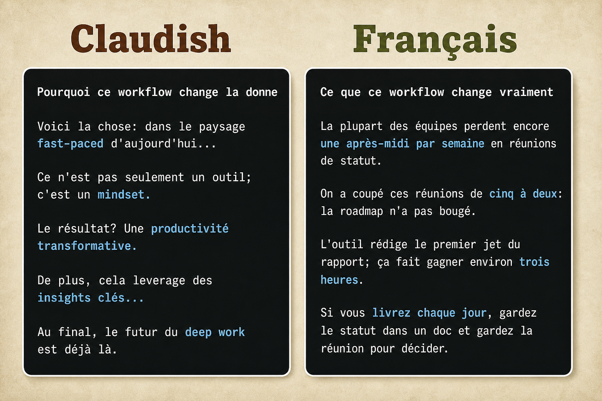

# Claudish / Français

On demande à Claude un **article**, un **post**, une annonce. Il sort du Claudish. Ce skill force la colonne **Français**: texte publiable, concret, sans glossaire IA.



| Claudish | Français |
| --- | --- |
| « Voici la chose... », pivots, leverage, game-changer | Le fait d'abord, sujets concrets, rythme humain |
| Version IA du post | Version qu'on publie |

## Portée

- Articles, posts, newsletters, mails, pitchs, changelogs narratifs
- **Chaque fois** que l'agent parle ou qu'on lui demande d'écrire quelque chose
- Optionnel: montrer les deux colonnes (avant/après) si on le demande

## Contenu

```text
skill-claudish-fr/
├── LICENSE
├── README.md
├── assets/claudish-vs-francais.png
├── rules/claudish-francais.mdc
└── skills/claudish-francais/
    ├── SKILL.md
    └── references/examples.md
```

## Installation (Cursor)

```bash
git clone https://github.com/Mossab28/skill-claudish-fr.git
cp -R skill-claudish-fr/skills/claudish-francais ~/.cursor/skills/
cp skill-claudish-fr/rules/claudish-francais.mdc ~/.cursor/rules/
```

La règle `alwaysApply: true` applique le registre à chaque tour.

## Exemple minute

**Brief:** post sur la baisse des réunions + un outil de rapports.

**Claudish:** « Voici la chose: dans le paysage fast-paced... game-changer... le futur est déjà là. »

**Français:** « On est passé de cinq réunions à deux. L'outil rédige le premier jet du rapport (~3 h/semaine). Gardez la réunion pour décider. »

## Licence

MIT
