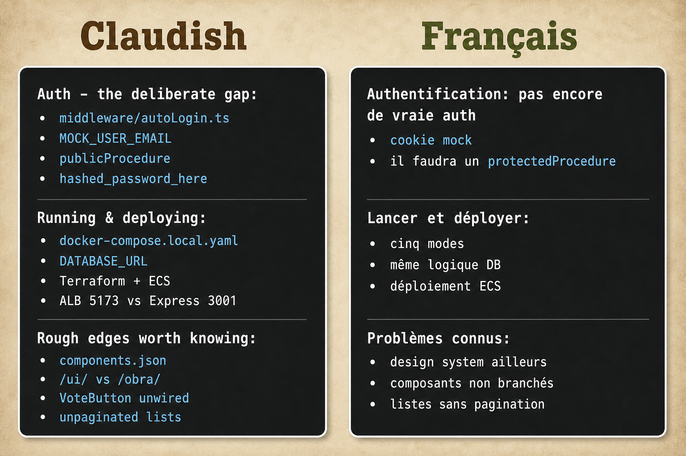

# claudish-to-french

<p align="center">
  
</p>

Plugin Claude Code qui affiche une **réécriture en français clair** de chaque message assistant, produite par un **LLM local via ollama**. Mode **display-only**: le raisonnement de Claude et le transcript gardent le texte original; seul l'affichage à l'écran change.

Un second hook optionnel réécrit des **fichiers Markdown** en français clair quand ils sont écrits ou édités (opt-in, off par défaut).

> Fork français de [gvzdv/claudish-to-english](https://github.com/gvzdv/claudish-to-english) (post Reddit: [r/ClaudeAI](https://www.reddit.com/r/ClaudeAI/comments/1vl0n1t/claude_code_plugin_for_translating_from_claudish/)). Même mécanique, cible = français clair au lieu de plain English.

> Statut: prototype. Chaque hook échoue **ouvert**: si ollama est down, timeout, ou dépendance manquante, tu vois le texte original de Claude. Le plugin ne peut pas avaler ni corrompre une réponse.

---

## Prérequis

| Besoin | Pourquoi | Install |
|---|---|---|
| **ollama**, en marche | Fait la réécriture en local | `brew install ollama` puis `ollama serve` |
| Un modèle tiré | Le réécrivain | `ollama pull gemma4:26b-mlx` (ou un plus petit) |
| `jq` | Parse le JSON des hooks | inclus macOS; sinon `brew install jq` |
| `curl` | Parle à ollama | inclus macOS |

Chauffe le modèle une fois:

```bash
ollama run gemma4:26b-mlx "salut"
```

Si le modèle local n'est pas prêt, le plugin ne touche pas au texte. Notice une fois par session (désactivable avec `CLAUDISH_NOTICE=0`).

---

## Install

```shell
/plugin marketplace add Mossab28/claudish-to-french
/plugin install claudish-to-french@mossab28-plugins
```

Si le résumé dit `Run /reload-plugins to activate.`, lance cette commande.

**Essai sans installer:**

```bash
claude --plugin-dir /path/to/claudish-to-french
```

---

## Config

Dans `~/.claude/settings.json`:

```json
{
  "env": {
    "CLAUDISH_MODEL": "gemma4:26b-mlx",
    "CLAUDISH_MODE": "append"
  }
}
```

Redémarre Claude Code après édition de `env`.

Test rapide:

```bash
CLAUDISH_MODEL=llama3.2:3b claude
```

Debug: `CLAUDISH_DEBUG=1` puis regarde `"$TMPDIR"/claudish-to-french/debug.log`.

---

## Modes d'affichage

| `CLAUDISH_MODE` | À l'écran |
|---|---|
| `append` (défaut) | L'original stream, puis un bloc `💬 En français clair:` |
| `replace` | Seulement la version simplifiée (expérimental) |

---

## Réécriture Markdown (optionnel)

Opt-in via `CLAUDISH_MD_DIR`. Seulement les `*.md` sous ce dossier.

| `CLAUDISH_MD_MODE` | Résultat |
|---|---|
| `sibling` (défaut) | Écrit `NOM.clair.md` à côté |
| `overwrite` | Remplace `NOM.md` + marqueur `<!-- claudish-to-french:rewritten -->` |

```json
{
  "env": {
    "CLAUDISH_MD_DIR": "/ABS/PATH/docs/clair",
    "CLAUDISH_MD_MODE": "sibling"
  }
}
```

---

## Variables d'environnement

| Var | Défaut | Sens |
|---|---|---|
| `CLAUDISH_ENABLED` | `1` | Interrupteur maître |
| `CLAUDISH_OFF_FILE` | `~/.claude/claudish-off` | Pause mid-session (`touch` / `rm`) |
| `CLAUDISH_MODE` | `append` | `append` ou `replace` |
| `CLAUDISH_MODEL` | `gemma4:26b-mlx` | Tag ollama |
| `CLAUDISH_OLLAMA` | `http://localhost:11434` | URL ollama |
| `CLAUDISH_MIN_CHARS` | `200` | Ignore les messages/fichiers trop courts |
| `CLAUDISH_TIMEOUT` | `45` | Timeout hook display (s) |
| `CLAUDISH_MD_TIMEOUT` | `150` | Timeout hook Markdown (s) |
| `CLAUDISH_DEBUG` | `0` | Log debug |
| `CLAUDISH_NOTICE` | `1` | Notice setup une fois / session |
| `CLAUDISH_MD_DIR` | *(unset)* | Opt-in Markdown |
| `CLAUDISH_MD_MODE` | `sibling` | `sibling` ou `overwrite` |
| `CLAUDISH_MD_SUFFIX` | `clair` | Infixe sibling |

Pause mid-session:

```bash
touch ~/.claude/claudish-off
rm    ~/.claude/claudish-off
```

---

## Confidentialité

Tout tourne **en local** contre ollama. Aucun contenu de conversation ne quitte la machine (sauf si tu pointes `CLAUDISH_OLLAMA` vers un endpoint distant).

---

## Crédits

- Original: [Mike Gvozdev / gvzdv](https://github.com/gvzdv/claudish-to-english) - MIT
- Post: [Claude Code plugin for translating from Claudish to English](https://www.reddit.com/r/ClaudeAI/comments/1vl0n1t/claude_code_plugin_for_translating_from_claudish/)

## Licence

MIT - voir [LICENSE](./LICENSE).
